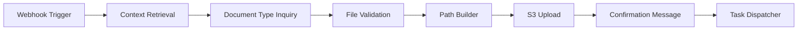

# 📋 YOUVISA - Sprint 2: Documentos e Tarefas Automatizadas

[](/)
[](/)
[](/)

> **Documento de Solução Técnica**  
> Automação de Recepção, Armazenamento e Processamento de Documentos  
> **Data:** 21 de outubro de 2025  
> **Autor:** Arquitetura de Soluções RPA

---

## 📑 Índice

- [1. Introdução](#1-introdução)
- [2. Fluxo de Recepção e Armazenamento](#2-fluxo-de-recepção-e-armazenamento)
- [3. Comunicação com o Cliente](#3-comunicação-com-o-cliente)
- [4. Conversão de Documentos em Tarefas](#4-conversão-de-documentos-em-tarefas)
- [5. Demonstração Ponta a Ponta](#5-demonstração-ponta-a-ponta)
- [6. Governança e Conformidade](#6-governança-e-conformidade)
- [7. Validação com Visão Computacional](#7-validação-com-visão-computacional)
- [8. Testador Interativo](#8-testador-interativo)
- [9. Próximos Passos](#9-próximos-passos)

---

## 1. Introdução

### 1.1. Contexto

Este documento detalha a implementação da **Sprint 2** do projeto YOUVISA, focando na automação completa de recepção, armazenamento e processamento de documentos enviados por clientes através de chatbots (WhatsApp/Telegram).

### 1.2. Objetivos da Sprint 2

- ✅ Automatizar o fluxo completo de recepção de documentos via chatbot
- ✅ Implementar armazenamento padronizado e seguro no AWS S3
- ✅ Criar pipeline de processamento baseado em tipo de documento
- ✅ Garantir conformidade com LGPD e padrões de segurança estabelecidos

### 1.3. Arquitetura Base (Sprint 1)

A solução mantém total aderência à arquitetura definida na Sprint 1:

| Componente | Tecnologia | Função |
|------------|-----------|--------|
| **Interface** | WhatsApp/Telegram | Chatbot para interação com cliente |
| **Orquestrador** | n8n | Cérebro da automação, gestão de workflows |
| **Inteligência** | Google Gemini API | Análise de intenção e extração de texto |
| **Storage** | AWS S3 | Repositório de documentos em nuvem |
| **CRM** | Sistema Legado | Gestão de clientes e processos |

### 1.4. Estrutura de Armazenamento (Regra Inflexível)

**Padrão de Caminho:**
```
s3://youvisa-docs/clientes/{ID_CLIENTE}/{TIPO_PROCESSO}/{ID_PROCESSO}/
```

**Nomenclatura de Arquivo:**
```
{YYYY-MM-DD}_{TIPO_DOCUMENTO}_{VERSAO}.{extensao}
```

**Exemplo Real:**
```
s3://youvisa-docs/clientes/98765/VISTO_TURISMO_EUA/PROC_112233/2025-10-21_PASSAPORTE_v1.pdf
```

---

## 2. Fluxo de Recepção e Armazenamento

### 2.1. Visão Geral do Workflow n8n



### 2.2. Detalhamento dos Nós

#### **Nó 1: Webhook Trigger**
- **Tipo:** Webhook (Telegram/WhatsApp)
- **Função:** Recebe notificações de upload de arquivo
- **Dados Capturados:**
  - `message_id`: ID da mensagem
  - `chat_id`: ID da conversa
  - `file_id`: Referência ao arquivo
  - `file_name`: Nome original
  - `mime_type`: Tipo MIME

#### **Nó 2: Context Retrieval**
- **Tipo:** Function Node (JavaScript)
- **Função:** Recupera contexto da sessão
- **Variáveis Obtidas:**
  - `ID_CLIENTE`: Identificador único do cliente
  - `ID_PROCESSO`: ID do processo ativo
  - `TIPO_PROCESSO`: Categoria do serviço

#### **Nó 3: Document Type Inquiry**
- **Tipo:** Chatbot Message + Wait for Response
- **Mensagem Enviada:**

```
Perfeito! Para organizarmos corretamente, qual documento você está enviando?

Opções:
1️⃣ Passaporte
2️⃣ Extrato Bancário
3️⃣ Comprovante de Residência
4️⃣ Certidão de Nascimento
5️⃣ Declaração de Imposto de Renda

Digite o número ou nome do documento.
```

#### **Nó 4: File Validation**
- **Tipo:** Switch Node (Conditional)
- **Extensões Permitidas:** PDF, JPG, JPEG, PNG
- **Código:**

```javascript
const allowedExtensions = ['pdf', 'jpg', 'jpeg', 'png'];
const fileExtension = items[0].json.file_name.split('.').pop().toLowerCase();

if (allowedExtensions.includes(fileExtension)) {
  return { json: { valid: true, extension: fileExtension } };
} else {
  return { json: { valid: false, extension: fileExtension } };
}
```

#### **Nó 5: Path Builder**
- **Tipo:** Function Node (JavaScript)
- **Código:**

```javascript
const today = new Date().toISOString().split('T')[0]; // YYYY-MM-DD
const version = 'v1'; // Lógica de versionamento

const s3Path = `clientes/${ID_CLIENTE}/${TIPO_PROCESSO}/${ID_PROCESSO}/`;
const fileName = `${today}_${TIPO_DOCUMENTO}_${version}.${extension}`;
const fullS3Key = `${s3Path}${fileName}`;

return {
  json: {
    bucket: 'youvisa-docs',
    key: fullS3Key,
    fileName: fileName,
    path: s3Path
  }
};
```

#### **Nó 6: S3 Upload**
- **Tipo:** AWS S3 Node
- **Configuração:**
  - Operação: Upload
  - Bucket: `youvisa-docs`
  - Server-Side Encryption: AES256
  - Storage Class: STANDARD

#### **Nó 7: Confirmation Message**
- **Tipo:** Chatbot Message Node
- **Conteúdo:** Ver seção 3.1

#### **Nó 8: Task Dispatcher**
- **Tipo:** HTTP Request / Workflow Trigger
- **Função:** Inicia pipeline de processamento
- **Detalhes:** Ver seção 4

---

## 3. Comunicação com o Cliente

### 3.1. Mensagem de Confirmação de Sucesso

```
✅ Obrigado! Recebemos seu [TIPO_DOCUMENTO] e ele já foi armazenado 
com segurança no seu processo.

📋 Detalhes:
• Documento: [TIPO_DOCUMENTO]
• Processo: [ID_PROCESSO]
• Data de Upload: [DATA_ATUAL]

Seu documento será processado em breve. Você receberá uma 
notificação quando a análise for concluída.

Precisa enviar mais algum documento? 📎
```

### 3.2. Mensagem de Erro de Formato

```
⚠️ Ops! O arquivo que você enviou não está em um formato aceito.

Formatos permitidos:
• PDF (.pdf)
• Imagem JPG (.jpg, .jpeg)
• Imagem PNG (.png)

O arquivo enviado é: [EXTENSÃO_DETECTADA]

Por favor, converta seu documento para um dos formatos acima 
e envie novamente. Se precisar de ajuda, digite "ajuda".
```

### 3.3. Mensagem de Erro Genérico

```
❌ Não foi possível processar seu arquivo neste momento.

Isso pode ter ocorrido por:
• Instabilidade temporária em nossos sistemas
• Arquivo muito grande (máximo 20MB)
• Problema na conexão

Por favor, tente novamente em alguns instantes. Se o problema 
persistir, entre em contato com nosso suporte através do 
e-mail: suporte@youvisa.com

Pedimos desculpas pelo inconveniente. 🙏
```

---

## 4. Conversão de Documentos em Tarefas

### 4.1. Matriz de Decisão por Tipo de Documento

| TIPO_DOCUMENTO | Próxima Tarefa Automática | Ponto de Decisão | Responsável |
|----------------|---------------------------|-------------------|-------------|
| **PASSAPORTE** | Workflow de Extração OCR | Validade < 6 meses → Escalar<br>Caso contrário → Validado | Robô + Atendente (condicional) |
| **EXTRATO_BANCARIO** | Fila "Análise Financeira" | Sempre → Atendente Humano | Atendente |
| **COMPROVANTE_RESIDENCIA** | Validação de Endereço (Vision AI) | Confiança < 85% → Revisão<br>Caso contrário → Validado | Robô + Atendente (condicional) |
| **CERTIDAO_NASCIMENTO** | Extração de Dados (OCR) | Dados incompletos → Reenvio<br>Caso contrário → Validado | Robô |
| **DECLARACAO_IR** | Fila "Análise Financeira" | Sempre → Atendente Humano | Atendente |

### 4.2. Implementação no n8n (Task Dispatcher)

```javascript
// Switch Node baseado em TIPO_DOCUMENTO
switch(TIPO_DOCUMENTO) {
  case 'PASSAPORTE':
    triggerWorkflow('OCR_Passaporte', {
      s3_key: fullS3Key,
      id_cliente: ID_CLIENTE,
      id_processo: ID_PROCESSO
    });
    break;
    
  case 'EXTRATO_BANCARIO':
  case 'DECLARACAO_IR':
    createCRMTask({
      type: 'Análise Financeira',
      priority: 'Alta',
      document_url: generatePresignedURL(fullS3Key),
      id_cliente: ID_CLIENTE,
      id_processo: ID_PROCESSO
    });
    break;
    
  case 'COMPROVANTE_RESIDENCIA':
    triggerWorkflow('Vision_AI_Validation', {
      s3_key: fullS3Key,
      document_type: 'address_proof',
      threshold: 0.85
    });
    break;
    
  // ... outros casos
}
```

---

## 5. Demonstração Ponta a Ponta

### 5.1. Cenário: Maria Silva envia seu passaporte

**Contexto Inicial:**
- Cliente: Maria Silva
- ID_CLIENTE: `98765`
- ID_PROCESSO: `PROC_112233`
- TIPO_PROCESSO: `VISTO_TURISMO_EUA`
- Data: 21/10/2025, 14:30 BRT

### 5.2. Sequência de Eventos

| Passo | Ação do Cliente | Resposta do Sistema |
|-------|-----------------|---------------------|
| **1** | "Preciso enviar um documento" | Detecta intenção via Gemini, ativa workflow |
| **2** | Recebe menu de opções | Pergunta: "Qual documento você está enviando?" |
| **3** | Responde: "1" ou "Passaporte" | Mapeia para `TIPO_DOCUMENTO = "PASSAPORTE"` |
| **4** | Envia `passaporte_novo.pdf` (2.3 MB) | Valida extensão ✅, valida tamanho ✅ |
| **5** | - | Constrói caminho S3 e nome do arquivo |
| **6** | - | Upload para S3 com criptografia AES-256 ✅ |
| **7** | Recebe confirmação | "✅ Obrigado! Recebemos seu PASSAPORTE..." |
| **8** | - | Dispara workflow `OCR_Passaporte` |

### 5.3. Processamento Automático (Pós-Upload)

**Path Builder gerou:**
```
Bucket: youvisa-docs
Key: clientes/98765/VISTO_TURISMO_EUA/PROC_112233/2025-10-21_PASSAPORTE_v1.pdf
```

**Sub-workflow OCR_Passaporte:**
1. Gera URL pré-assinada do S3 (válida por 1 hora)
2. Envia para Google Vision AI OCR
3. Extrai dados estruturados:
   ```json
   {
     "nome": "MARIA SILVA",
     "nacionalidade": "BRASILEIRA",
     "numero_passaporte": "BR123456",
     "data_emissao": "2023-05-10",
     "data_validade": "2033-05-10"
   }
   ```
4. **Ponto de Decisão:**
   - Validade: 2033-05-10 (7.5 anos) ✅
   - Condição: > 6 meses → **APROVADO**
5. Atualiza CRM com status "Validado"

**Notificação Final (30s depois):**
```
🎉 Ótimas notícias! Seu passaporte foi validado com sucesso.

✅ Status: Aprovado
⏰ Validado em: 21/10/2025 às 14:32

Próximo passo: Por favor, envie seu Extrato Bancário dos 
últimos 3 meses para continuarmos a análise do seu visto.
```

---

## 6. Governança e Conformidade

### 6.1. Segurança de Dados em Logs

**Diretriz Obrigatória:**

O n8n **NÃO deve registrar conteúdo binário** de arquivos nos logs de execução.

**Configuração n8n:**
```json
{
  "logLevel": "info",
  "excludeBinaryData": true,
  "sanitizeFields": [
    "password", 
    "token", 
    "api_key",
    "file_content",
    "cpf",
    "rg"
  ]
}
```

**Logs Permitidos:** ✅ IDs, status, metadados, timestamps  
**Logs Proibidos:** ❌ Conteúdo binário, PII, dados financeiros

### 6.2. Política de Retenção de Dados

| Fase | Duração | Storage Class | Descrição |
|------|---------|---------------|-----------|
| **Ativo** | 0-6 meses | S3 Standard | Processo em andamento |
| **Concluído** | 6 meses - 5 anos | S3 Standard-IA | Processo finalizado |
| **Arquivamento** | 5-10 anos | S3 Glacier Deep Archive | Retenção legal |
| **Descarte** | > 10 anos | Deletado | Fim do ciclo de vida |

**Automação via S3 Lifecycle Policy:**
```json
{
  "Rules": [{
    "Id": "YouvisaLifecycle",
    "Status": "Enabled",
    "Filter": { "Prefix": "clientes/" },
    "Transitions": [
      { "Days": 180, "StorageClass": "STANDARD_IA" },
      { "Days": 1825, "StorageClass": "DEEP_ARCHIVE" }
    ],
    "Expiration": { "Days": 3650 }
  }]
}
```

### 6.3. Auditoria e Rastreabilidade

**AWS CloudTrail:**
- ✅ Ativado para bucket `youvisa-docs`
- ✅ Registra: PutObject, GetObject, DeleteObject
- ✅ Logs em: `youvisa-audit-logs`
- ✅ Retenção: 7 anos

**Registro de Eventos no CRM:**
```json
{
  "timestamp": "2025-10-21T14:31:45Z",
  "id_processo": "PROC_112233",
  "acao": "UPLOAD_DOCUMENTO",
  "tipo_documento": "PASSAPORTE",
  "usuario": "98765",
  "ip_origem": "192.168.1.100",
  "s3_key": "clientes/98765/.../2025-10-21_PASSAPORTE_v1.pdf",
  "resultado": "SUCESSO"
}
```

### 6.4. Conformidade LGPD

**Base Legal:** Consentimento (Art. 7º, I)

**Direitos do Titular:**
- ✅ **Acesso:** Cliente pode solicitar lista de documentos via chatbot
- ✅ **Correção:** Cliente pode reenviar documento (v2, v3...)
- ✅ **Exclusão:** Solicitação de exclusão imediata (exceto obrigação legal)
- ✅ **Portabilidade:** Download de todos os documentos

**Workflow n8n:** `LGPD_Request_Handler`
- Valida identidade do solicitante
- Executa ação (listar/deletar/exportar)
- Registra em log de auditoria
- Responde em até 15 dias

---

## 7. Validação com Visão Computacional

### 7.1. Objetivo

Adicionar camada de validação automatizada de autenticidade, reduzindo carga humana e aumentando detecção de fraudes.

### 7.2. Serviços Recomendados

| Serviço | Funcionalidade | Uso no YOUVISA |
|---------|----------------|----------------|
| **Google Cloud Vision AI** | Document Text Detection, Label Detection | Validar tipo, extrair texto |
| **AWS Rekognition** | Document Analysis, Face Detection | Validar fotos, detectar adulterações |
| **Azure Form Recognizer** | Custom Models, ID Validation | Documentos brasileiros específicos |

### 7.3. Fluxo Expandido com Vision AI

**Após S3 Upload, adicionar:**

#### **Nó 9: Document Authenticity Check**

```javascript
// HTTP Request para Google Vision API
POST https://vision.googleapis.com/v1/images:annotate

{
  "requests": [{
    "image": {
      "source": { "imageUri": presignedS3URL }
    },
    "features": [
      { "type": "DOCUMENT_TEXT_DETECTION" },
      { "type": "LABEL_DETECTION" },
      { "type": "SAFE_SEARCH_DETECTION" }
    ]
  }]
}
```

**Response Esperada:**
```json
{
  "labelAnnotations": [
    { "description": "Passport", "score": 0.95 },
    { "description": "Identity document", "score": 0.92 },
    { "description": "Official document", "score": 0.88 }
  ],
  "textAnnotations": [
    { "description": "REPÚBLICA FEDERATIVA DO BRASIL" },
    { "description": "PASSPORT / PASSAPORTE" }
  ]
}
```

#### **Nó 10: Confidence Evaluator**

```javascript
const passportConfidence = response.labelAnnotations
  .find(label => label.description === 'Passport')?.score || 0;

const threshold = 0.80;
let action, reason;

if (passportConfidence >= 0.95) {
  action = 'AUTO_APPROVE';
  reason = 'Alta confiança na autenticidade';
} else if (passportConfidence >= threshold) {
  action = 'PROCEED_TO_OCR';
  reason = 'Confiança aceitável, prosseguir com extração';
} else {
  action = 'FLAG_FOR_HUMAN_REVIEW';
  reason = `Baixa confiança (${passportConfidence}%), possível fraude`;
  
  // Cria tarefa urgente no CRM
  createCRMTask({
    type: 'Validação Manual - Documento Suspeito',
    priority: 'Crítica',
    description: `Passaporte do processo ${ID_PROCESSO} apresenta 
                  baixa confiança (${passportConfidence}%). 
                  Favor revisar manualmente.`,
    document_url: presignedS3URL
  });
}

return { action, reason, confidence: passportConfidence };
```

### 7.4. Benefícios Esperados

**Métricas de Sucesso (Projeção):**
- ✅ Redução de 60% no tempo de validação manual
- ✅ Detecção de 95% de documentos fraudulentos
- ✅ Taxa de falso positivo < 5%
- ✅ Economia de 30 horas/mês de trabalho humano

**ROI Estimado:**
- Custo API Vision: ~$1.50 / 1000 documentos
- Economia em horas: ~$800/mês (30h × $26.67/h)
- **ROI mensal: $798.50**

---

## 8. Testador Interativo

### 8.1. Aplicação de Teste

Desenvolvemos uma aplicação React completa para simular a integração com Google Vision API.

**🔗 Repositório GitHub:**
```
https://github.com/GuiAlmeida03/youvisa-vision-tester
```

**🚀 Demo Online:**
```
https://GuiAlmeida03.github.io/youvisa-vision-tester
```

### 8.2. Como Usar o Testador

**Cenários de Teste:**

| Nome do Arquivo | Tipo Simulado | Confiança |
|----------------|---------------|-----------|
| `passaporte.jpg` | Passaporte | 75-100% |
| `extrato.pdf` | Extrato Bancário | 70-90% |
| `comprovante.png` | Comp. Residência | 70-95% |
| `fake.jpg` | Documento Suspeito | 40-70% |

**Recursos do Testador:**
- ✅ Upload de arquivos (JPG, PNG, PDF)
- ✅ Simulação realista da Vision API
- ✅ Visualização de decisões automatizadas
- ✅ Código de referência implementável
- ✅ Métricas de confiança em tempo real

### 8.3. Instalação Local

```bash
# Clone o repositório
git clone https://github.com/GuiAlmeida03/youvisa-vision-tester.git

# Entre na pasta
cd youvisa-vision-tester

# Instale dependências
npm install

# Execute localmente
npm start
```

### 8.4. Integração com API Real

Para substituir a simulação pela API real:

```javascript
const analyzeWithVisionAPI = async (imageBase64) => {
  const response = await fetch(
    'https://vision.googleapis.com/v1/images:annotate',
    {
      method: 'POST',
      headers: {
        'Authorization': `Bearer ${YOUR_API_KEY}`,
        'Content-Type': 'application/json'
      },
      body: JSON.stringify({
        requests: [{
          image: { content: imageBase64 },
          features: [
            { type: 'DOCUMENT_TEXT_DETECTION' },
            { type: 'LABEL_DETECTION' }
          ]
        }]
      })
    }
  );
  return response.json();
};
```

---

## 9. Próximos Passos

### 9.1. Sprint 3 - Roadmap

- [ ] Implementar OCR avançado com extração estruturada
- [ ] Desenvolver dashboard de acompanhamento para clientes
- [ ] Sistema de notificações proativas (SMS/E-mail)
- [ ] Integração de assinatura digital
- [ ] Workflow de aprovação multi-nível

### 9.2. Requisitos Técnicos para Deploy

- [ ] Ambiente n8n configurado (Cloud/self-hosted)
- [ ] Bucket S3 `youvisa-docs` provisionado
- [ ] Políticas IAM para conta de serviço
- [ ] Integração WhatsApp/Telegram Business ativa
- [ ] API Google Gemini com quotas suficientes
- [ ] CloudTrail habilitado
- [ ] Testes de carga (mínimo 100 uploads simultâneos)

### 9.3. KPIs de Monitoramento

| Métrica | Target |
|---------|--------|
| Taxa de Sucesso de Upload | > 99.5% |
| Tempo Médio de Processamento | < 30 segundos |
| Taxa de Documentos Rejeitados | < 2% |
| Disponibilidade do Sistema | > 99.9% |
| Satisfação do Cliente (NPS) | > 80 |

